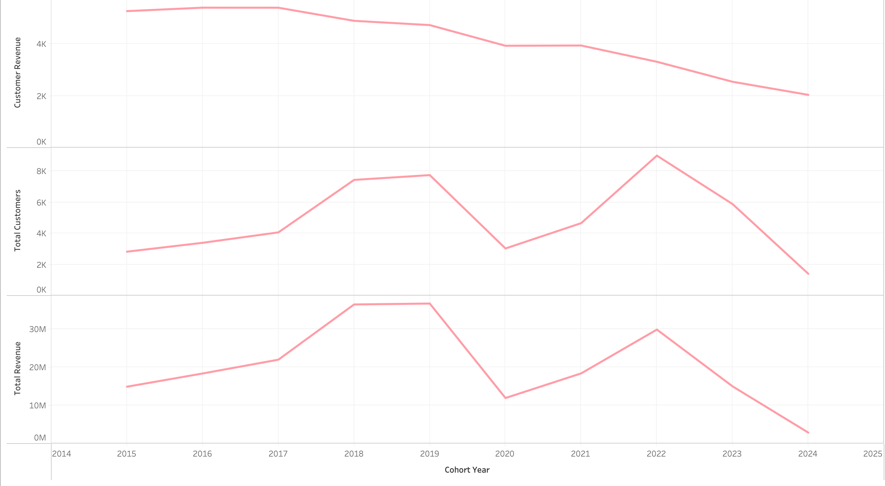
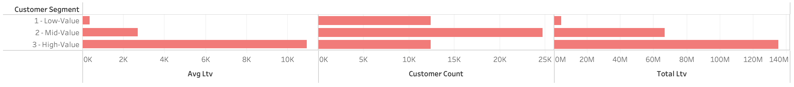
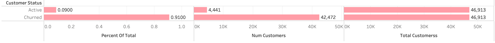
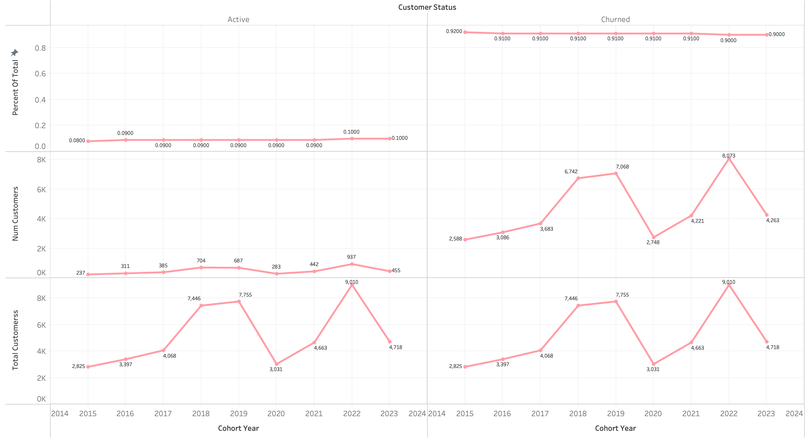

# SQL-customer_analysis

## Introduction 

The **dataset used** in this project are available for access [here](/database).

## Objective 


## Preliminary preparation 

```sql
CREATE VIEW cohort_analysis
AS WITH customer_revenue AS (
         SELECT s.customerkey,
            s.orderdate,
            sum(s.quantity::double precision * s.netprice * s.exchangerate) AS net_revenue,
            count(s.orderdate) AS num_orders,
            c.countryfull,
            c.age,
            c.givenname,
            c.surname
           FROM sales s
             LEFT JOIN customer c ON s.customerkey = c.customerkey
          GROUP BY c.countryfull, c.age, c.givenname, c.surname, c.customerkey, s.customerkey, s.orderdate
          ORDER BY s.customerkey
        )
 SELECT customerkey,
    orderdate,
    net_revenue,
    num_orders,
    countryfull,
    age,
    CONCAT(TRIM(givenname),' ',TRIM(surname)) AS cleaned_name,
    min(orderdate) OVER (PARTITION BY customerkey) AS first_purchase_date,
    EXTRACT(year FROM min(orderdate) OVER (PARTITION BY customerkey)) AS cohort_year
   FROM customer_revenue cr;
```
## Project 1 

```sql
SELECT
	cohort_year,
	COUNT(DISTINCT customerkey) AS total_customers,
	SUM(net_revenue) AS total_revenue,
	SUM(net_revenue) / COUNT(DISTINCT customerkey) AS customer_revenue
FROM
	cohort_analysis
GROUP BY
	cohort_year
```

<div align="center">
  
</div>


📈 2015–2019 cohorts show strong performance, with customer revenue above $4.7K–$5.4K per customer.

📉 Starting in 2020, average customer revenue drops sharply — from ~$3.9K in 2020–2021 down to just ~$2K in 2024.

📊 While total customers grew significantly in 2018 (7.4K) and 2022 (9K), the average customer revenue declined, suggesting growth came from lower-value customers.

⚠️ 2023–2024 cohorts show the weakest performance, combining fewer customers with the lowest revenue per customer, indicating a concerning downward trend.


## Project 2


```sql
WITH customer_ltv AS (
	SELECT
		customerkey,
		cleaned_name,
		SUM(net_revenue) AS total_ltv
	FROM cohort_analysis
	
	GROUP BY 
		customerkey,
		cleaned_name
	ORDER BY customerkey
), customer_segments AS (
SELECT
	PERCENTILE_CONT(0.25) WITHIN GROUP (ORDER BY total_ltv) AS ltv_25th_percentile,
	PERCENTILE_CONT(0.75) WITHIN GROUP (ORDER BY total_ltv) AS ltv_75th_percentile
FROM customer_ltv
), segment_values AS (
SELECT 
	c.*,
	CASE
		WHEN c.total_ltv < cs.ltv_25th_percentile THEN '1 - Low-Value '
		WHEN c.total_ltv > cs.ltv_75th_percentile THEN '3 - High-Value '
		ELSE '2 - Mid-Value'
	END AS customer_segment
	
FROM
	customer_ltv c,
	customer_segments cs
)

SELECT
	customer_segment,
	SUM(total_ltv) AS total_ltv,
	COUNT(customerkey) AS customer_count,
	SUM(total_ltv) / COUNT(customerkey) AS avg_ltv
FROM
	segment_values 
GROUP BY 
	customer_segment
```

<div align="center">
  
</div>


💎 High-Value customers (12,372 customers) generate the largest total LTV at $135M+, with an average LTV of ~$10.9K — they are the most critical to long-term revenue.

📊 Mid-Value customers (24,743 customers) contribute a significant $66M+ total LTV, averaging ~$2.7K per customer, making them an important segment for scalable growth.

⚠️ Low-Value customers (12,372 customers) drive only $4.3M total LTV, with an average LTV of just ~$351, meaning they add volume but limited financial impact.
## Project 3 


```sql
WITH customer_last_purchase AS (
SELECT
	customerkey,
	cleaned_name,
	orderdate,
	ROW_NUMBER() OVER( PARTITION BY customerkey ORDER BY orderdate DESC) AS rn,
	first_purchase_date,
	cohort_year
FROM
	cohort_analysis
), churned_customers AS (
	SELECT
		customerkey,
		cleaned_name,
		first_purchase_date,
		orderdate AS last_purchase_date,
		CASE
			WHEN orderdate < (SELECT MAX(orderdate) FROM sales) - INTERVAL '6 months'  THEN 'Churned'
			ELSE 'Active'
		END AS customer_status,
		cohort_year
	
	FROM customer_last_purchase
	WHERE rn = '1'
		AND first_purchase_date < (SELECT MAX(orderdate) FROM sales) - INTERVAL '6 months'
)

SELECT
	customer_status,
	COUNT(customerkey) AS num_customers,
	SUM(COUNT(customerkey)) OVER( PARTITION BY cohort_year) AS total_customerss,
	ROUND(COUNT(customerkey) / SUM(COUNT(customerkey)) OVER(PARTITION BY cohort_year), 2) AS percent_of_total,
	cohort_year
FROM
	churned_customers 
GROUP BY
		cohort_year,
		customer_status

```

<div align="center">
  
</div>


Here are the main takeaways from the 2015–2024 customer status chart:

🚨 Across all years, 91% of customers churned, leaving only 9% active.

📉 This consistent pattern highlights very weak long-term retention.

💰 The imbalance poses a serious threat to sustainable revenue growth.


💡 Strong retention and reactivation strategies are needed to reverse the trend.


<div align="center">
  
</div>


Here are 3 main takeaways from the 2015–2023 cohort data:

🚨 Churn is consistently very high — about 90–92% of customers leave across all cohorts.

📊 Even as customer acquisition grew significantly (from ~2.8K in 2015 to ~9K in 2022), the active share stayed flat at only 8–10%.

✅ Recent cohorts (2022–2023) show a slight improvement in retention (10% active), but the gain is minimal.

## How to Use  

1. **Install dependencies**: pandas, matplotlib, numpy.
2. **Load datasets**: use pd.read_csv() and adjust the file path/directory as needed.


## Author  
Created by **Arsen Pankiv**  
- [LinkedIn](https://www.linkedin.com/in/arsen-pankiv-6082b4349/)  
- [GitHub](https://github.com/Arsen-Pankiv)
